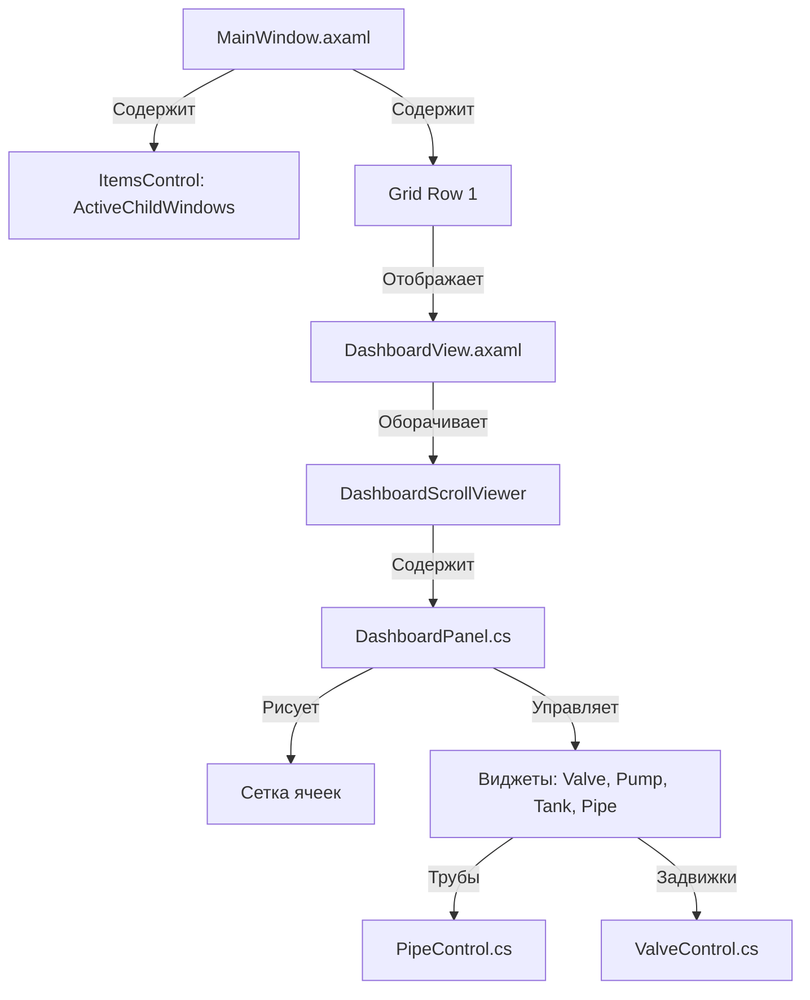

# Текущий Статус Проекта (Project Status & Roadmap)

Этот файл служит единой точкой входа для отслеживания глобального прогресса разработки, ключевой архитектуры и текущего статуса. Он спроектирован так, чтобы любой ИИ-ассистент при перезапуске сессии мог за 30 секунд восстановить полный контекст проекта.

---

## 🎯 Глобальные Цели и Дорожная Карта (Roadmap)

- [x] **Этап 1: Базовый MDI-интерфейс и MQTT-клиент**
  - Реализация плавающих окон с перетаскиванием и изменением размеров.
  - Подключение к брокеру MQTT, замена локального симулятора сетевыми тегами.
- [x] **Этап 2: Конструктор Мнемосхем (SCADA Мнемосхема)**
  - Сетка 10x10 для точного позиционирования виджетов.
  - Отрисовка объёмных трубопроводов с фланцами, отводами и автопривязкой (snapping).
  - Единый контрол задвижки `ValveControl` с поддержкой 4-х типов приводов и поворота на 90°.
  - Динамические MDI-пульты управления насосами и регулирующими задвижками.
  - Двусторонняя интеграция физической симуляции процессов смесителя с MQTT-топиками.
- [x] **Этап 3: Полировка UX и Стабилизация**
  - [x] Плавный инерционный скролл холста по `Spacebar + ЛКМ`.
  - [x] Автозакрытие дублирующихся контекстных меню труб.
  - [x] Запрет на утаскивание заголовков MDI-окон под верхнее меню (Y >= 0).
  - [x] Уменьшение зоны ресайза виджетов с 60px до 20px для исключения ложных срабатываний.
- [ ] **Этап 4: Модуль IoT-ретрансляции (Modbus-MQTT Bridge)**
  - [ ] Разработка фоновой службы шлюза для обмена данными.
  - [ ] Карта регистров Modbus TCP/RTU для связи с физическими контроллерами.
  - [ ] Интерфейс мониторинга и конфигурации шлюза.

---

## 🛠️ Архитектурная Карта (Architectural Map)

### Ключевые файлы и их задачи:
*   [MainWindow.axaml.cs](file:///c:/Users/ess2/source/repos/AvaloniaApplication1/AvaloniaApplication1/MainWindow.axaml.cs) — Управляет поведением MDI-окон (перетаскивание, ресайз, наложение/ZIndex, ограничение по границам `Y >= 0`).
*   [DashboardPanel.cs](file:///c:/Users/ess2/source/repos/AvaloniaApplication1/AvaloniaApplication1/Views/DashboardPanel.cs) — Главный холст конструктора. Отвечает за позиционирование виджетов по сетке 10x10, алгоритмы привязки (snapping) труб к клапанам, и запуск перемещения/изменения размеров виджетов (зона ресайза `20x20`).
*   [DashboardView.axaml.cs](file:///c:/Users/ess2/source/repos/AvaloniaApplication1/AvaloniaApplication1/Views/DashboardView.axaml.cs) — Отвечает за скролл (панорамирование). Содержит таймер для сглаживания и физику инерции при отпускании мыши.
*   [PipeControl.cs](file:///c:/Users/ess2/source/repos/AvaloniaApplication1/AvaloniaApplication1/Views/PipeControl.cs) — Кастомный рендеринг труб, фланцев и отводов. Содержит статический метод `CloseActiveMenu()` для уничтожения дублирующих меню.
*   [ValveControl.cs](file:///c:/Users/ess2/source/repos/AvaloniaApplication1/AvaloniaApplication1/Views/ValveControl.cs) — Отрисовывает задвижки с поддержкой приводов и вращения.

---

## 🔄 Актуальный Статус и Восстановление Контекста

*   **Где мы остановились:**
    *   Все требования по полировке интерфейса (панорамирование, закрытие контекстных меню, границы окон, хит-бокс ресайза) полностью реализованы.
    *   Успешно разработан и интегрирован механизм **«резиновой связи» (rubber-banding)**: при перетаскивании задвижек и насосов привязанные трубы автоматически растягиваются/сжимаются в реальном времени, следуя за их фланцами. Все обновленные координаты корректно сохраняются в файл конфигурации `config.json`.
    *   Ведется журнал прогресса в проекте (файлы в папке `docs/` и текущий `status.md`).
*   **Текущее состояние сборки:** Сборка успешна, предупреждений об ошибках компиляции нет.
*   **Следующий шаг:** Переход к проектированию промышленного Modbus-MQTT шлюза (Этап 4).

