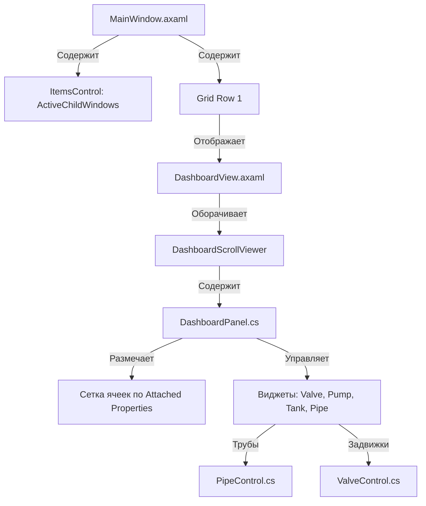

# Текущий Статус Проекта (Project Status & Roadmap)

Этот файл служит единой точкой входа для отслеживания глобального прогресса разработки, ключевой архитектуры и текущего статуса. Он спроектирован так, чтобы любой ИИ-ассистент при перезапуске сессии мог за 30 секунд восстановить полный контекст проекта.

---

## 🎯 Глобальные Цели и Дорожная Карта (Roadmap)

- [x] **Этап 1: Базовый MDI-интерфейс и MQTT-клиент**
  - Реализация плавающих окон с перетаскиванием и изменением размеров.
  - Подключение к брокеру MQTT, замена локального симулятора сетевыми тегами.
- [x] **Этап 2: Конструктор Мнемосхем (SCADA Мнемосхема)**
  - Сетка 10x10 для точного позиционирования виджетов.
  - Отрисовка объёмных трубопроводов с фланцами, отводами и автопривязкой (snapping).
  - Единый контрол задвижки `ValveControl` с поддержкой 4-х типов приводов и поворота на 90°.
  - Динамические MDI-пульты управления насосами и регулирующими задвижками.
  - Двусторонняя интеграция физической симуляции процессов смесителя с MQTT-топиками.
- [x] **Этап 3: Полировка UX и Стабилизация**
  - [x] Плавный инерционный скролл холста по `Spacebar + ЛКМ`.
  - [x] Автозакрытие дублирующихся контекстных меню труб.
  - [x] Запрет на утаскивание заголовков MDI-окон под верхнее меню (Y >= 0).
  - [x] Уменьшение зоны ресайза виджетов с 60px до 20px для исключения ложных срабатываний.
- [x] **Этап 3.5: Архитектурный рефакторинг и оптимизация телеметрии**
  - [x] Разметка сетки дашборда на Attached Properties (`Col`, `Row`, `SizeX`, `SizeY`) для декаплинга от VM.
  - [x] Оптимизация телеметрии (`Setpoint`, `Feedback`, `IsFilled`, `Values`) через `DirectProperty`.
  - [x] Валидация и коэрсия (Coercion) значений в свойствах для защиты данных.
  - [x] Выравнивание слотов прилипания труб точно по визуальным фланцам (рендерингу) задвижек и насосов вместо центров их bounding-боксов.
  - [x] Внедрение выделенного режима редактирования вершин труб (через контекстное меню) для устранения конфликтов перетаскивания всей трубы и ее вершин.
- [ ] **Этап 4: Модуль IoT-ретрансляции (Modbus-MQTT Bridge)**

  - [ ] Разработка фоновой службы шлюза для обмена данными.
  - [ ] Карта регистров Modbus TCP/RTU для связи с физическими контроллерами.
  - [ ] Интерфейс мониторинга и конфигурации шлюза.
Дополнение в Дорожную Карту (Вставить после Этапа 4)
[ ] Этап 5: Подсистема Аварийной Сигнализации и Событий (Alarms & Events)

[ ] Движок обработки алармов: Модуль проверки технологических параметров на выход за границы (HiHi, Hi, Lo, LoLo, Rate of Change, Deviation) на стороне бэкенда/шлюза.

[ ] Компонент AlarmBand / AlarmJournal: Активный графический виджет (таблица) для отображения текущих аварий с цветовой кодировкой по приоритетам (Критический, Предупреждение, Информационный).

[ ] Квитирование (Acknowledgment): Механизм подтверждения аварий оператором с фиксацией времени и метки учетной записи.

[ ] Звуковая сигнализация: Интеграция воспроизведения предупреждающих звуковых сигналов при возникновении критических событий.

[ ] Этап 6: Исторические Данные, Тренды и Архивирование (Historian & Long-term Trending)

[ ] Модуль циклического архивирования: Оптимизированный сборщик данных для записи телеметрии в тайм-серийную БД (например, SQLite/LiteDB для локального HMI-исполнения или поддержка InfluxDB/TimescaleDB для сетевого уровня).

[ ] Эволюция TrendLineControl: Поддержка исторического режима (Historical Mode). Добавление панорамирования по оси времени (Timeline), масштабирования (Zoom), визирных линий (курсоров-линеек) для считывания точных значений в точке.

[ ] Экспорт данных: Инструмент выгрузки выбранных интервалов технологических параметров в форматы CSV/XLSX.

[ ] Этап 7: Безопасность, Ролевая Модель (RBAC) и Аудит

[ ] Система авторизации: Разделение прав доступа (Оператор, Технолог, Инженер АСУ ТП, Администратор).

[ ] Блокировка управления: Динамическое ограничение интерактивности виджетов (например, клик по ValveControl для открытия MDI-пульта задвижки доступен только авторизованному Оператору/Технологу).

[ ] Журнал Действий Оператора (Audit Trail): Недокументируемый лог всех действий пользователей (изменение уставок Setpoint, ручное открытие/закрытие задвижек, квитирование алармов) с фиксацией штампа времени, старого и нового значений.

[ ] Этап 8: Системные функции и Жизненный цикл (System & Lifecycle)

[ ] Менеджер Проектов (Режим Раскомпиляции/Рантайма): Разделение приложения на режим Разработки (Design Time — сохранение/загрузка всей мнемосхемы, сетки, связей труб и топиков в JSON/XML файл конфигурации) и режим Исполнения (Runtime — чистая визуализация без возможности двигать виджеты).

[ ] Контроль Связи (Watchdog): Визуальная индикация потери связи с Modbus-контроллерами или MQTT-брокером (например, обесцвечивание / "посерение" виджетов при недостоверности данных — Quality Bad).
---

## 🛠️ Архитектурная Карта (Architectural Map)

### Ключевые файлы и их задачи:
*   [MainWindow.axaml.cs](file:///c:/Users/ess2/source/repos/AvaloniaApplication1/AvaloniaApplication1/MainWindow.axaml.cs) — Управляет поведением MDI-окон (перетаскивание, ресайз, наложение/ZIndex, ограничение по границам `Y >= 0`).
*   [DashboardPanel.cs](file:///c:/Users/ess2/source/repos/AvaloniaApplication1/AvaloniaApplication1/Views/DashboardPanel.cs) — Главный холст конструктора. Отвечает за позиционирование виджетов по сетке 10x10 с использованием Attached Properties, алгоритмы привязки (snapping) труб к клапанам, и запуск перемещения/изменения размеров виджетов (зона ресайза `20x20`).
*   [DashboardView.axaml.cs](file:///c:/Users/ess2/source/repos/AvaloniaApplication1/AvaloniaApplication1/Views/DashboardView.axaml.cs) — Отвечает за скролл (панорамирование). Содержит таймер для сглаживания и физику инерции при отпускании мыши.
*   [PipeControl.cs](file:///c:/Users/ess2/source/repos/AvaloniaApplication1/AvaloniaApplication1/Views/PipeControl.cs) — Кастомный рендеринг труб, фланцев и отводов. `IsFilled` переведен на DirectProperty, `Thickness` защищен коэрсией.
*   [ValveControl.cs](file:///c:/Users/ess2/source/repos/AvaloniaApplication1/AvaloniaApplication1/Views/ValveControl.cs) — Отрисовывает задвижки с поддержкой приводов и вращения. `Setpoint` и `Feedback` переведены на DirectProperty.
*   [TrendLineControl.cs](file:///c:/Users/ess2/source/repos/AvaloniaApplication1/AvaloniaApplication1/Views/TrendLineControl.cs) — Отрисовывает тренд реального времени. Свойство `Values` переведено на DirectProperty, а `MinY`/`MaxY` защищены коэрсией.

---

## 🔄 Актуальный Статус и Восстановление Контекста

*   **Где мы остановились:**
    *   Реализовано точное прилипание труб к визуальным фланцам задвижек и насосов.
    *   Добавлен выделенный интерактивный режим редактирования вершин труб, включаемый через контекстное меню ("Редактировать вершины" / "Завершить редактирование"). Это полностью решило проблему конфликта перетаскивания всей трубы с перетаскиванием ее отдельных вершин. Выделение сбрасывается автоматически при потере фокуса.
    *   Ведется журнал прогресса в проекте (файлы в папке `docs/` и текущий `status.md`).
*   **Текущее состояние сборки:** Сборка успешна, предупреждений об ошибках компиляции нет.
*   **Следующий шаг:** Переход к проектированию промышленного Modbus-MQTT шлюза (Этап 4).

